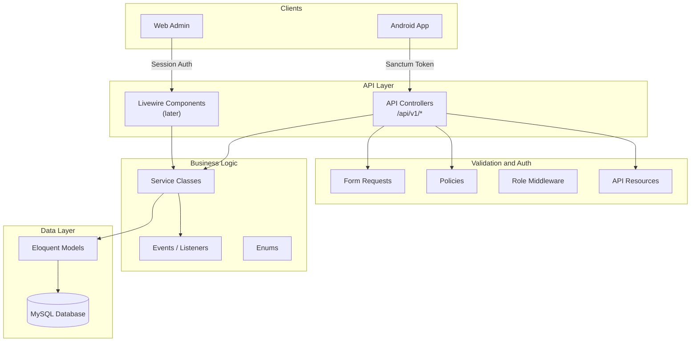
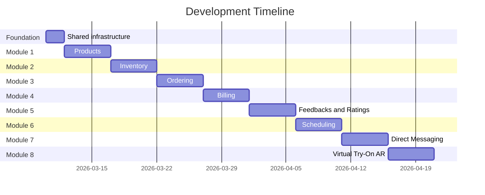

# Backend Foundation for Optical Management System

> **Implementation update (2026-04-09):** `ar_model_url` is stored on **`product_variants`**, not on `products`, so each sellable variant can have its own `.glb`/`.usdz` URL. Migration: `2026_04_09_160000_move_ar_model_url_to_product_variants` (copies existing product URLs onto all variants of each product, then drops `products.ar_model_url`). The API still accepts `ar_model_url` on product create/update for convenience; `ProductService` applies it to the **default variant** via `applyArModelToDefaultVariant`. `ProductVariantResource` exposes `ar_model_url`; admin Livewire flows edit AR per variant. Listing UIs treat “AR available” as **any variant** with a URL when the category has `has_ar_support`.
>
> **Schema update (products):** There is **no `suppliers` table** — vendor contact info is out of scope. **`cost_per_unit`** lives on **`product_variants`** (not `products`) so margin differs per material/color/SKU. **`product_images`** has optional **`product_variant_id`**: `NULL` = shared gallery for the whole product; set = image shown when that variant is selected (e.g. red vs blue frame). If migrating from `products.cost_per_unit`, copy values onto each variant (or default variant only) then drop the product column.

## Architecture Overview

The backend follows a **layered service architecture** where business logic lives in service classes, and delivery mechanisms (API controllers for Android, Livewire for web admin later) are thin wrappers that delegate to services.




## Directory Structure

All new code lives inside `backend/app/` following Laravel conventions with added layers:

```
app/
├── Enums/                          # PHP 8.1+ backed enums
│   ├── UserRole.php                # admin, staff, customer
│   ├── OrderStatus.php             # pending, confirmed, ready, completed, cancelled
│   ├── PaymentStatus.php           # unpaid, partially_paid, paid, refunded, voided
│   └── AppointmentStatus.php       # scheduled, confirmed, completed, cancelled
├── Http/
│   ├── Controllers/
│   │   └── Api/
│   │       └── V1/                 # Versioned API controllers
│   │           ├── Auth/
│   │           │   └── AuthController.php
│   │           ├── ProductController.php
│   │           ├── OrderController.php
│   │           ├── BillingController.php
│   │           ├── ServiceTypeController.php
│   │           ├── ScheduleTemplateController.php
│   │           ├── TimeSlotController.php
│   │           ├── AppointmentController.php
│   │           ├── ConversationController.php
│   │           ├── MessageController.php
│   │           ├── InventoryController.php
│   │           └── FeedbackController.php
│   ├── Middleware/
│   │   └── EnsureUserHasRole.php   # Role-based gate
│   ├── Requests/Api/V1/            # Validation per endpoint
│   └── Resources/V1/               # JSON response transformers
├── Models/                         # Eloquent models with relationships
├── Policies/                       # Authorization policies
├── Services/                       # Business logic (the core)
├── Events/                         # Domain events
├── Listeners/                      # Side-effect handlers
├── Exceptions/
│   └── ApiExceptionHandler.php     # Consistent API error responses
└── Traits/                         # Shared model/service traits
```

## Database Schema (Core Entities)

```mermaid
erDiagram
    User ||--o{ Order : places
    User ||--o{ Appointment : books
    User ||--o{ Feedback : writes
    User ||--o{ Conversation : starts
    User {
        bigint id PK
        string name
        string email UK
        string password
        string phone
        enum role
        string avatar_url
        timestamp email_verified_at
    }

    ProductCategory ||--o{ Product : contains
    Product ||--o{ ProductImage : has
    Product ||--o{ ProductVariant : has
    ProductVariant ||--o{ ProductImage : shows
    Product ||--o{ Feedback : reviewed_in
    ProductVariant ||--o{ OrderItem : ordered_as
    ProductVariant ||--o| Inventory : tracked_in
    Product {
        bigint id PK
        bigint category_id FK
        string name
        text description
        decimal price
        string brand
        boolean is_active
    }

    ProductVariant {
        bigint id PK
        bigint product_id FK
        string sku UK
        string color
        string frame_size
        string material
        string lens_type
        string base_curve
        string diameter
        decimal price_adjustment
        decimal cost_per_unit
        boolean is_default
        boolean is_active
        string ar_model_url_nullable
    }

    ProductCategory {
        bigint id PK
        string name
        string slug UK
        text description
        boolean has_ar_support
        boolean requires_expiry_tracking
    }

    ProductImage {
        bigint id PK
        bigint product_id FK
        bigint product_variant_id FK_nullable
        string image_url
        integer sort_order
    }

    Order ||--o{ OrderItem : contains
    Order {
        bigint id PK
        bigint user_id FK_nullable
        bigint created_by FK_nullable
        string walk_in_name
        string walk_in_phone
        string order_number UK
        enum status
        decimal total_amount
        decimal discount_amount
        string discount_reason
        text notes
    }

    OrderItem {
        bigint id PK
        bigint order_id FK
        bigint product_variant_id FK
        integer quantity
        decimal unit_price
        decimal subtotal
    }

    Order ||--o| Bill : generates
    Appointment ||--o| Bill : generates

    Bill {
        bigint id PK
        bigint order_id FK_nullable
        bigint appointment_id FK_nullable
        string invoice_number UK
        decimal amount
        decimal amount_paid
        decimal balance_due
        enum payment_status
        string payment_method
        timestamp paid_at
    }

    ScheduleTemplate ||--o{ TimeSlot : generates
    ScheduleTemplate {
        bigint id PK
        string name
        integer day_of_week
        time start_time
        time end_time
        integer slot_duration_minutes
        integer max_capacity
        boolean is_active
    }

    ServiceType ||--o{ Appointment : categorizes
    ServiceType {
        bigint id PK
        string name
        text description
        integer default_duration_minutes
        decimal default_fee
        boolean is_active
    }

    TimeSlot ||--o{ Appointment : booked_in
    TimeSlot {
        bigint id PK
        bigint schedule_template_id FK_nullable
        date date
        time start_time
        time end_time
        integer max_capacity
        boolean is_available
    }

    Appointment {
        bigint id PK
        bigint user_id FK_nullable
        bigint staff_id FK_nullable
        bigint created_by FK_nullable
        string walk_in_name
        string walk_in_phone
        bigint time_slot_id FK
        bigint service_type_id FK
        decimal fee
        enum status
        text notes
        text staff_notes
    }

    Conversation ||--o{ Message : contains
    Conversation {
        bigint id PK
        bigint customer_id FK
        string subject
        enum status
        timestamp last_message_at
    }

    Message {
        bigint id PK
        bigint conversation_id FK
        bigint sender_id FK
        text body
        timestamp read_at
    }

    Inventory {
        bigint id PK
        bigint product_variant_id FK
        integer quantity
        integer reorder_level
        integer reorder_quantity
        string batch_number
        date expires_at
        text notes
    }

    Inventory ||--o{ InventoryAdjustment : tracks
    InventoryAdjustment {
        bigint id PK
        bigint inventory_id FK
        integer quantity_before
        integer quantity_after
        integer delta
        string adjustment_type
        string reason
        bigint adjusted_by FK_nullable
    }

    Feedback {
        bigint id PK
        bigint user_id FK
        bigint product_id FK
        integer rating
        text comment
    }
```


## Module Behavior Summary

**Products** -- Optical catalog for a local PH optical clinic. Categories: Eyeglass Frames, Prescription Lenses, Contact Lenses, Sunglasses, Accessories (cases, cleaning solutions, cloths, etc.). Product-level fields include base selling price (`products.price`) and brand metadata. **Cost per unit** is stored on each **product variant** (`product_variants.cost_per_unit`) so margin can differ by material, color, or SKU. **Images** attach to a product; optional **`product_variant_id`** on `product_images` means `NULL` = shared gallery for all variants, non-null = image shown when that variant is selected (e.g. frame color). Each product has one or more **product variants** (color, frame size, material, lens type, base curve, diameter, price adjustment — fields nullable when not applicable to the category). **AR virtual try-on** uses an optional **`ar_model_url` per variant** (see implementation update above). Creating a product without defining extra variants still yields an internal **default variant** used for stock and simple ordering. Admin has full CRUD. Staff and customers can view only.

**Ordering** -- In-store pickup model. No prescription data, no delivery/shipping. Cart is managed client-side (Android app stores items locally). At checkout, one API call creates the order with all items. System validates stock availability before accepting -- order is blocked if any item is out of stock. Staff can also create orders for registered customers (phone orders) or walk-ins; `created_by` tracks which staff member processed the order. Lifecycle: Pending -> Confirmed -> Ready for Pickup -> Completed (or Cancelled). Customers can cancel before Ready for Pickup; after that, only staff/admin can cancel. Staff can optionally record a manual `discount_amount` with a `discount_reason` (e.g., "Senior Citizen 20%", "PWD discount") which is deducted from the order total before billing. A bill is auto-generated with each order.

**Billing** -- Invoice tracking only, no payment gateway. Bills are generated for both orders and paid appointments. Admin/staff marks payments as received. Customer sees their own bills. Lifecycle: Unpaid -> Partially Paid -> Paid (or Refunded / Voided). Partial payments are tracked using `amount_paid` and `balance_due`, supporting deposit-on-order and balance-on-pickup workflows. When an order is cancelled before payment, the bill is voided. When cancelled after partial/full payment, the bill is marked refunded.

**Scheduling** -- Time-slot based with predefined service types and named schedule templates. Admin manages service types (Eye Examination, Contact Lens Fitting, Frame Adjustment/Repair, Follow-up Consultation) with default durations and fees. Admin creates named schedule templates (e.g., "Regular Hours Mon-Fri", "Saturday Hours") and the system generates time slots for a date range based on those templates; each time slot retains a `schedule_template_id` link back to the template that generated it. Admin can override individual slots (mark unavailable, adjust capacity). Customers pick a service type + open time slot to book. `staff_id` records which optometrist/staff handles the appointment; `created_by` tracks who booked it (the customer themselves, or a staff member on behalf of a walk-in). One appointment per customer per time slot; multiple appointments per day allowed (e.g., eye exam morning, fitting afternoon). Appointments with a fee (e.g., standalone eye exam PHP 300) auto-generate a bill. Free appointments do not. Cancelled appointments free up the slot capacity. SMS notifications for customers (event/listener structure, actual SMS integration later).

**Direct Messaging** -- Real-time team inbox using Laravel Reverb (WebSockets). Customer starts a conversation with the shop. Conversations have a `status` (open / closed) so staff can mark resolved threads as closed. Any staff/admin can view and respond to open conversations. New messages are broadcast instantly via private channels. Messages have read tracking. REST API for history/sending, WebSocket for live delivery.

**Inventory** -- Stock tracker keyed per **product variant** (default variant covers single-SKU products) with quantity, reorder level, reorder quantity, optional batch number, and optional expiry date. Category-level `requires_expiry_tracking` controls whether `expires_at` is required. Every quantity change writes an `inventory_adjustments` audit row (`before`, `after`, `delta`, `type`, `reason`, `adjusted_by`). Admin adjusts levels. Staff views only. Stock is validated when orders are placed (order blocked if out of stock). Stock is not auto-decremented on order confirmation (manual adjustment for now, can be automated later via events).

**Feedbacks** -- Customers rate products (1-5 stars + comment). One review per customer per product. Staff/admin can view all. Admin can delete inappropriate reviews.

**Virtual Try-On** -- Backend stores an optional AR model URL **per product variant** (`product_variants.ar_model_url`). Category-level `has_ar_support` gates which categories use AR. All AR rendering is client-side (e.g. Android).

## Key Decisions

- **Roles**: Simple `role` enum column on `users` table (admin/staff/customer) -- 3 roles with clear boundaries, no need for a full RBAC package
- **Staff permissions**: Staff can process orders, record manual order discounts, record partial/full bill payments, respond to messages, manage schedules, and view inventory -- but cannot manage products, adjust inventory levels, issue refunds/voids, or access system settings
- **API Versioning**: URL-based (`/api/v1/`) so Android app can be updated independently
- **Auth**: Sanctum token auth for API (Android), session auth for web (Livewire admin later)
- **Validation**: Form Request classes per endpoint -- keeps controllers thin
- **Responses**: API Resource classes for consistent JSON structure
- **Business Logic**: Service classes injected into controllers via constructor -- testable, swappable
- **Soft Deletes**: On products, orders, and users to prevent accidental data loss
- **Database**: MySQL with proper foreign keys, indexes, and unique constraints
- **AR / virtual try-on**: `has_ar_support` on `product_categories` flags categories that can use AR; **`ar_model_url` on `product_variants`** stores a path/URL to the 3D model file per sellable variant. Legacy/API payloads may still send `ar_model_url` on the product; the service maps that to the **default variant**. New products automatically get a **default product variant** (and empty inventory row) so catalog entries work without manually defining variants.
- **Expiry enforcement**: `requires_expiry_tracking` on `product_categories` controls whether inventory `expires_at` is mandatory for products in that category (e.g., contact lens solutions), while durable products (e.g., frames) can keep `expires_at` nullable.
- **SKU**: Stored on **`product_variants`** (one unique code per sellable variant). Auto-generated on variant create when not provided (format `PRD-` + 8 random alphanumeric characters). The `Product` model exposes `sku` as the **default variant’s** SKU for convenience in lists and legacy views. Not mass-assignable; searchable via product search and variant records.
- **Cost per unit**: Stored on **`product_variants`** so profit margin reflects each sellable SKU (e.g. titanium vs acetate). Not on `products`.
- **Product images**: `product_images.product_variant_id` is nullable. Shared gallery when `NULL`; when set, the image is variant-specific and clients should prefer it when that variant is selected.
- **Inventory audit trail**: `inventory_adjustments` stores each stock quantity change with actor and reason for accountability.
- **Real-time messaging**: Laravel Reverb (WebSocket server) + Laravel Broadcasting for instant message delivery. Private channels per conversation, authorized via Sanctum.
- **Walk-in support**: `user_id` is nullable on orders and appointments. Walk-in customers identified by `walk_in_name` + `walk_in_phone` fields instead.
- **Staff attribution**: `created_by` on orders and appointments tracks which staff member processed the transaction; `staff_id` on appointments records the assigned optometrist/staff. Both are nullable (customer self-service sets `created_by` to their own ID).
- **Discount tracking**: `discount_amount` + `discount_reason` on orders lets staff manually apply and document SC/PWD or promotional discounts without an automated discount engine.
- **Variant lifecycle**: `is_active` on `product_variants` allows deactivating a specific color/size/material without soft-deleting the entire product.
- **Client-side cart**: Android app manages the cart locally; backend receives all items in a single order creation call. No cart table needed.
- **Stock validation**: Orders are blocked if any item is out of stock. Stock is checked at order creation time against the inventory table.
- **Order cancellation**: Customers can cancel before "Ready for Pickup." After that, only staff/admin. Bill is voided (if unpaid) or refunded (if partially/fully paid).
- **Schedule templates**: Admin defines named weekly templates (day, start/end time, slot duration, capacity). System batch-generates time slots for a date range. Each generated time slot keeps a `schedule_template_id` reference for traceability. Individual slots can be overridden.
- **Appointment billing**: Paid appointments (fee > 0) auto-generate a bill. Free appointments do not. Bills support both orders and appointments via two nullable foreign keys.
- **Conversation lifecycle**: Conversations have a simple `status` enum (open / closed) so staff can close resolved threads and filter the inbox.

## Module Workflows: Mobile (Android) vs Web (Admin)

Every module shares the same backend services — the Android app and the web admin panel are just two different interfaces calling the same business logic. Here is what each role sees and does on each platform.

### Products

| | Android App | Web Admin (Livewire) |
|---|---|---|
| **Customer** | Browse catalog with filters (category, brand, price). View product details, images, variant options. Tap "Try On" for AR-enabled variants. | N/A — customers don't use web admin. |
| **Staff** | Same browsing as customer. Can look up products to assist walk-ins. | View product list. Cannot create, edit, or delete. |
| **Admin** | Same browsing as customer (rarely used). | Full product CRUD: create/edit products, manage variants (color, size, material, lens type), set **`cost_per_unit` per variant**, upload shared and variant-specific images (`product_variant_id`), set prices, toggle `is_active` per variant. Category settings: toggle `has_ar_support` and `requires_expiry_tracking`. |

### Inventory

| | Android App | Web Admin |
|---|---|---|
| **Customer** | Sees "In Stock" / "Out of Stock" badge on products. No quantities shown. | N/A |
| **Staff** | Views current stock levels per variant. Sees low-stock alerts. Cannot adjust quantities. | Same view as Android but on a wider screen with table layout. |
| **Admin** | Same as staff view. | Adjusts stock quantities (receive shipment, damage write-off, correction). Every adjustment is logged with before/after quantities, reason, and who did it. Manages reorder levels and batch/expiry info. |

### Ordering

| | Android App | Web Admin |
|---|---|---|
| **Customer** | Adds items to local cart (stored on device). Selects variant, quantity. At checkout, submits order in one API call. Views own order history and status (Pending → Confirmed → Ready → Completed). Can cancel before "Ready for Pickup." | N/A |
| **Staff** | Creates orders on behalf of walk-ins (enters `walk_in_name` + `walk_in_phone`) or registered customers (phone orders). Applies manual discounts with reason (e.g., "Senior Citizen 20%"). Updates order status through the lifecycle. | Same capabilities on a wider screen. Order management dashboard with filters by status, date, customer. |
| **Admin** | Same as staff. | Full order management. Can cancel at any stage. Views all orders with staff attribution (`created_by`). |

### Billing

| | Android App | Web Admin |
|---|---|---|
| **Customer** | Views own bills (invoice number, amount, balance due, payment status). Digital receipt view. | N/A |
| **Staff** | Records payments received (cash, GCash, etc.). Updates `amount_paid` and `balance_due`. Supports partial payments (deposit now, balance on pickup). | Same with a table view of all bills. Easier data entry on desktop. |
| **Admin** | Same as staff. | All staff capabilities plus: void unpaid bills, mark bills as refunded, view billing reports. |

### Scheduling

| | Android App | Web Admin |
|---|---|---|
| **Customer** | Picks a service type (Eye Exam, Contact Lens Fitting, etc.), selects a date, sees available time slots, and books. Views own upcoming/past appointments. Can cancel before appointment time. | N/A |
| **Staff** | Books appointments for walk-ins. Views daily/weekly schedule. Assigned as `staff_id` to handle specific appointments. Adds `staff_notes` after each session. | Calendar view of all appointments. Easier to manage daily schedule on desktop. |
| **Admin** | Same as staff. | Manages service types (name, duration, fee). Creates/edits named schedule templates ("Regular Mon-Fri", "Saturday Hours"). Generates time slots for date ranges. Overrides individual slots (mark unavailable, change capacity). |

### Direct Messaging

| | Android App | Web Admin |
|---|---|---|
| **Customer** | Opens a conversation with the shop. Sends messages, sees real-time replies via WebSocket. Views conversation history. | N/A |
| **Staff** | Team inbox: sees all open customer conversations. Responds to any thread. Messages appear in real-time. Can close resolved conversations. | Same inbox on desktop — easier to type longer responses. |
| **Admin** | Same as staff. | Same as staff. Can reopen closed conversations if needed. |

### Feedback & Ratings

| | Android App | Web Admin |
|---|---|---|
| **Customer** | Rates a purchased product (1-5 stars + comment). One review per product. Views other customers' reviews on product pages. | N/A |
| **Staff** | Views ratings on product pages. Cannot write reviews. | View-only access to all feedback. |
| **Admin** | Same as staff. | Deletes inappropriate reviews. Views average ratings per product. |

### Virtual Try-On (AR)

| | Android App | Web Admin |
|---|---|---|
| **Customer** | Taps "Try On" on AR-enabled variants. AR camera overlay renders the 3D model on the user's face. All rendering is client-side (ARCore). | N/A |
| **Staff** | Can demo AR try-on to in-store customers on a device. | N/A — no AR on web. |
| **Admin** | N/A | Uploads/manages AR model URLs per product variant. Toggles `has_ar_support` at category level. |

### Summary

The Android app is the **customer-facing storefront** and the **staff field tool**. Customers browse, order, book, message, and review. Staff uses the same app to process walk-in orders, book appointments, record payments, and respond to messages.

The web admin is the **back-office control panel**. Admin manages the catalog, inventory, schedules, templates, service types, and system settings. Staff can also use web admin for tasks that benefit from a larger screen (order dashboard, billing table, schedule calendar), but their permissions are the same as on mobile.

Both platforms hit the same `/api/v1/` endpoints (Android via Sanctum token auth, web admin via Livewire + session auth), calling the same service layer underneath. No business logic is duplicated.

## Development Approach: Foundation + Module-by-Module

Development is split into a **lean shared foundation** followed by **one module per week**. Each module includes its own migrations, models, service, controller, form requests, API resources, policy, and seeders -- everything needed for that module to work end-to-end.




### Phase 0: Shared Foundation (1-2 days)

Only the infrastructure that ALL modules depend on:

1. **Database config** -- Switch from SQLite to MySQL in `.env.example` and verify config
2. **User model update** -- Add migration for `role`, `phone`, `avatar_url` columns on `users` table
3. **UserRole enum** -- Create `App\Enums\UserRole` (admin, staff, customer). Other enums created with their modules.
4. **Sanctum API auth** -- Configure Sanctum for token-based auth. Create `AuthController` with register, login, logout, profile endpoints.
5. **Role middleware** -- Create `EnsureUserHasRole` middleware. Register in app middleware stack.
6. **API route structure** -- Set up `routes/api.php` with `/v1/` prefix, auth routes, and role-based route groups.
7. **Exception handling** -- Customize API exception rendering for consistent JSON error format: `{ "message": "...", "errors": {...} }`
8. **User seeders** -- Admin, staff, and customer test accounts.

After this, any module can be built and tested with real auth and role checks.

### Phase 1: Products Module (Week 1)

The first full module. Everything needed for product catalog to work:

- **Migrations**: `product_categories`, `products`, `product_images` (with nullable `product_variant_id`), `product_variants` (incl. `cost_per_unit`, optical fields, `price_adjustment`; orders and inventory reference variants)
- **Models**: `ProductCategory`, `Product`, `ProductImage`, `ProductVariant` with relationships, casts, scopes (`active()`, `byCategory()`); observer ensures default variant + inventory on product create
- **Service**: `ProductService` (list with filters/pagination, create, update, soft delete, manage images with optional variant scope)
- **Controller**: `ProductController` (CRUD endpoints)
- **Form Requests**: `StoreProductRequest`, `UpdateProductRequest`
- **API Resources**: `ProductResource`, `ProductCategoryResource`, `ProductImageResource` (includes `product_variant_id`), `ProductVariantResource` (includes `ar_model_url`, `cost_per_unit` per variant)
- **Policy**: `ProductPolicy` (admin: full CRUD, staff/customer: view only)
- **Web admin settings UI**: Category settings screen for toggling `has_ar_support` and `requires_expiry_tracking`
- **Routes**: Product endpoints within role-based route groups
- **Seeder**: Sample categories and products for testing

**API Endpoints for Products Module:**

- `GET    /api/v1/products` -- List products (all roles, with filters: category, brand, search, price range)
- `GET    /api/v1/products/{id}` -- View product details (all roles)
- `POST   /api/v1/products` -- Create product (admin only)
- `PUT    /api/v1/products/{id}` -- Update product (admin only)
- `DELETE /api/v1/products/{id}` -- Soft delete product (admin only)
- `POST   /api/v1/products/{id}/images` -- Upload product images (admin only)
- `DELETE /api/v1/products/{id}/images/{imageId}` -- Delete image (admin only)
- `GET    /api/v1/product-categories` -- List categories (all roles)
- `POST   /api/v1/product-categories` -- Create category (admin only)
- `PUT    /api/v1/product-categories/{id}` -- Update category (admin only)
- `DELETE /api/v1/product-categories/{id}` -- Delete category (admin only)

### Future Modules (subsequent weeks)

Each follows the same pattern -- migration, model, service, controller, requests, resources, policy, seeder:

- **Module 2: Inventory** -- inventory table keyed by `product_variant_id`, stock tracking per variant, reorder level + reorder quantity, batch/expiry fields, adjustment history audit trail, admin adjusts stock, staff views only
- **Module 3: Ordering** -- `OrderStatus` enum, orders, `order_items` referencing `product_variant_id`, stock validation against inventory, walk-in support, cancellation rules
- **Module 4: Billing** -- `PaymentStatus` enum, bills table (linked to orders and later appointments), partial/full payment tracking (`amount_paid`, `balance_due`), void/refund logic
- **Module 5: Feedbacks and Ratings** -- feedbacks table, one review per customer per product, rating (1-5) + comment
- **Module 6: Scheduling** -- `AppointmentStatus` enum, service_types, schedule_templates, time_slots, appointments tables, slot generation logic, appointment billing
- **Module 7: Direct Messaging** -- conversations, messages tables, Laravel Reverb setup, broadcast events, private channels, read tracking
- **Module 8: Virtual Try-On AR** -- AR model URLs per **variant** (and/or upload/storage workflow); serve URLs via API (`ProductVariantResource`); rendering stays Android-side

## Scope and Limitations (for Capstone Paper)

**In scope:**

- Product catalog with categories (frames, lenses, contacts, sunglasses, accessories)
- In-store pickup ordering (no delivery/shipping)
- Invoice/billing tracking (manual payment recording, no gateway)
- Time-slot scheduling with predefined service types
- Real-time direct messaging (team inbox via WebSockets)
- Inventory management (single-branch stock tracking)
- Customer feedback and ratings
- AR virtual try-on (backend stores **per-variant** 3D model URLs; rendering is Android-side)
- Walk-in customer support (staff creates orders/appointments for non-registered customers)
- Role-based access control (admin, staff, customer)
- SMS notification structure for scheduling (event/listener, actual SMS integration deferred)

**Limitations:**

- Prescription records are excluded due to additional compliance requirements under RA 10173 (Data Privacy Act of 2012), which classifies health/medical data as sensitive personal information requiring enhanced security, explicit consent, and breach notification protocols
- Automated SC/PWD discount computation (RA 9994, RA 10754) is not included; staff can manually apply discounts using `orders.discount_amount`

**Future recommendations:**

- Prescription record management with full DPA compliance (encryption, audit logging, consent)
- Automated SC/PWD discount calculation
- Package deals and bundle pricing
- Promotional codes and discount engine
- Payment gateway integration (GCash, Maya)
- Multi-branch support with branch-level data scoping

## Module Development Pattern

Every module follows the same layered pattern:

1. **Migration** -- Create tables with proper foreign keys and indexes
2. **Model** -- Eloquent model with relationships, casts, scopes
3. **Enum** -- Status enums if the module has stateful entities
4. **Service** -- Business logic class (create, update, list with filters, etc.)
5. **Controller** -- Thin API controller that validates, authorizes, delegates to service, returns resource
6. **Form Requests** -- Validation rules per endpoint
7. **API Resources** -- JSON response transformers
8. **Policy** -- Authorization rules per role
9. **Routes** -- Register endpoints in role-based route groups
10. **Seeder** -- Sample data for development and testing

No business logic in controllers, no SQL in controllers, no response formatting in services -- each layer has one job.