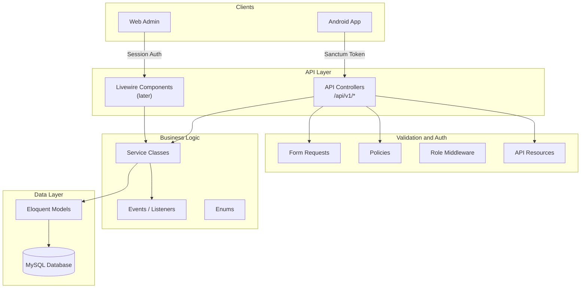
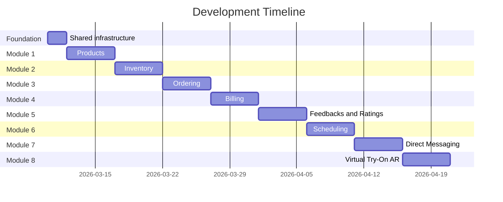

# Backend Foundation for Optical Management System

## Architecture Overview

The backend follows a **layered service architecture** where business logic lives in service classes, and delivery mechanisms (API controllers for Android, Livewire for web admin later) are thin wrappers that delegate to services.




## Directory Structure

All new code lives inside `backend/app/` following Laravel conventions with added layers:

```
app/
├── Enums/                          # PHP 8.1+ backed enums
│   ├── UserRole.php                # admin, staff, customer
│   ├── OrderStatus.php             # pending, confirmed, ready, completed, cancelled
│   ├── PaymentStatus.php           # unpaid, partially_paid, paid, refunded, voided
│   └── AppointmentStatus.php       # scheduled, confirmed, completed, cancelled
├── Http/
│   ├── Controllers/
│   │   └── Api/
│   │       └── V1/                 # Versioned API controllers
│   │           ├── Auth/
│   │           │   └── AuthController.php
│   │           ├── ProductController.php
│   │           ├── OrderController.php
│   │           ├── BillingController.php
│   │           ├── ServiceTypeController.php
│   │           ├── ScheduleTemplateController.php
│   │           ├── TimeSlotController.php
│   │           ├── AppointmentController.php
│   │           ├── ConversationController.php
│   │           ├── MessageController.php
│   │           ├── InventoryController.php
│   │           └── FeedbackController.php
│   ├── Middleware/
│   │   └── EnsureUserHasRole.php   # Role-based gate
│   ├── Requests/Api/V1/            # Validation per endpoint
│   └── Resources/V1/               # JSON response transformers
├── Models/                         # Eloquent models with relationships
├── Policies/                       # Authorization policies
├── Services/                       # Business logic (the core)
├── Events/                         # Domain events
├── Listeners/                      # Side-effect handlers
├── Exceptions/
│   └── ApiExceptionHandler.php     # Consistent API error responses
└── Traits/                         # Shared model/service traits
```

## Database Schema (Core Entities)

```mermaid
erDiagram
    User ||--o{ Order : places
    User ||--o{ Appointment : books
    User ||--o{ Feedback : writes
    User ||--o{ Conversation : starts
    User {
        bigint id PK
        string name
        string email UK
        string password
        string phone
        enum role
        string avatar_url
        timestamp email_verified_at
    }

    ProductCategory ||--o{ Product : contains
    Product ||--o{ ProductImage : has
    Product ||--o{ ProductVariant : has
    Product ||--o{ Feedback : reviewed_in
    ProductVariant ||--o{ OrderItem : ordered_as
    ProductVariant ||--o| Inventory : tracked_in
    Product {
        bigint id PK
        bigint category_id FK
        string name
        text description
        decimal price
        decimal cost_per_unit
        string brand
        string gender
        string ar_model_url
        boolean is_active
    }

    ProductVariant {
        bigint id PK
        bigint product_id FK
        string sku UK
        string color
        string frame_size
        string material
        string lens_type
        decimal price_adjustment
        boolean is_default
    }

    ProductCategory {
        bigint id PK
        string name
        string slug UK
        text description
        boolean has_ar_support
    }

    ProductImage {
        bigint id PK
        bigint product_id FK
        string image_url
        integer sort_order
    }

    Order ||--o{ OrderItem : contains
    Order {
        bigint id PK
        bigint user_id FK_nullable
        string walk_in_name
        string walk_in_phone
        string order_number UK
        enum status
        decimal total_amount
        decimal discount_amount
        text notes
    }

    OrderItem {
        bigint id PK
        bigint order_id FK
        bigint product_variant_id FK
        integer quantity
        decimal unit_price
        decimal subtotal
    }

    Order ||--o| Bill : generates
    Appointment ||--o| Bill : generates

    Bill {
        bigint id PK
        bigint order_id FK_nullable
        bigint appointment_id FK_nullable
        string invoice_number UK
        decimal amount
        decimal amount_paid
        decimal balance_due
        enum payment_status
        string payment_method
        timestamp paid_at
    }

    ScheduleTemplate ||--o{ TimeSlot : generates
    ScheduleTemplate {
        bigint id PK
        integer day_of_week
        time start_time
        time end_time
        integer slot_duration_minutes
        integer max_capacity
        boolean is_active
    }

    ServiceType ||--o{ Appointment : categorizes
    ServiceType {
        bigint id PK
        string name
        text description
        integer default_duration_minutes
        decimal default_fee
        boolean is_active
    }

    TimeSlot ||--o{ Appointment : booked_in
    TimeSlot {
        bigint id PK
        date date
        time start_time
        time end_time
        integer max_capacity
        boolean is_available
    }

    Appointment {
        bigint id PK
        bigint user_id FK_nullable
        string walk_in_name
        string walk_in_phone
        bigint time_slot_id FK
        bigint service_type_id FK
        decimal fee
        enum status
        text notes
        text staff_notes
    }

    Conversation ||--o{ Message : contains
    Conversation {
        bigint id PK
        bigint customer_id FK
        string subject
        timestamp last_message_at
    }

    Message {
        bigint id PK
        bigint conversation_id FK
        bigint sender_id FK
        text body
        timestamp read_at
    }

    Inventory {
        bigint id PK
        bigint product_variant_id FK
        integer quantity
        integer reorder_level
        text notes
    }

    Feedback {
        bigint id PK
        bigint user_id FK
        bigint product_id FK
        integer rating
        text comment
    }
```


## Module Behavior Summary

**Products** -- Optical catalog for a local PH optical clinic. Categories: Eyeglass Frames, Prescription Lenses, Contact Lenses, Sunglasses, Accessories (cases, cleaning solutions, cloths, etc.). Product-level fields include base selling price plus optional compare-at price and cost per unit, along with brand/gender metadata. Each product has one or more **product variants** (color, frame size, material, lens type, price adjustment — fields nullable when not applicable to the category). Creating a product without defining extra variants still yields an internal **default variant** used for stock and simple ordering. Admin has full CRUD. Staff and customers can view only.

**Ordering** -- In-store pickup model. No prescription data, no delivery/shipping. Cart is managed client-side (Android app stores items locally). At checkout, one API call creates the order with all items. System validates stock availability before accepting -- order is blocked if any item is out of stock. Staff can also create orders for registered customers (phone orders) or walk-ins. Lifecycle: Pending -> Confirmed -> Ready for Pickup -> Completed (or Cancelled). Customers can cancel before Ready for Pickup; after that, only staff/admin can cancel. Staff can optionally record a manual `discount_amount` (e.g., SC/PWD) which is deducted from the order total before billing. A bill is auto-generated with each order.

**Billing** -- Invoice tracking only, no payment gateway. Bills are generated for both orders and paid appointments. Admin/staff marks payments as received. Customer sees their own bills. Lifecycle: Unpaid -> Partially Paid -> Paid (or Refunded / Voided). Partial payments are tracked using `amount_paid` and `balance_due`, supporting deposit-on-order and balance-on-pickup workflows. When an order is cancelled before payment, the bill is voided. When cancelled after partial/full payment, the bill is marked refunded.

**Scheduling** -- Time-slot based with predefined service types and schedule templates. Admin manages service types (Eye Examination, Contact Lens Fitting, Frame Adjustment/Repair, Follow-up Consultation) with default durations and fees. Admin creates schedule templates (e.g., "Mon-Sat, 9AM-5PM, 30-min slots") and the system generates time slots for a date range based on those templates. Admin can override individual slots (mark unavailable, adjust capacity). Customers pick a service type + open time slot to book. One appointment per customer per time slot; multiple appointments per day allowed (e.g., eye exam morning, fitting afternoon). Appointments with a fee (e.g., standalone eye exam PHP 300) auto-generate a bill. Free appointments do not. Cancelled appointments free up the slot capacity. SMS notifications for customers (event/listener structure, actual SMS integration later).

**Direct Messaging** -- Real-time team inbox using Laravel Reverb (WebSockets). Customer starts a conversation with the shop. Any staff/admin can view and respond. New messages are broadcast instantly via private channels. Messages have read tracking. REST API for history/sending, WebSocket for live delivery.

**Inventory** -- Simple stock tracker. One record per **product variant** with quantity and reorder level (the default variant covers single-SKU products). Admin adjusts levels. Staff views only. Stock is validated when orders are placed (order blocked if out of stock). Stock is not auto-decremented on order confirmation (manual adjustment for now, can be automated later via events).

**Feedbacks** -- Customers rate products (1-5 stars + comment). One review per customer per product. Staff/admin can view all. Admin can delete inappropriate reviews.

**Virtual Try-On** -- Backend only stores AR model URL on products. All AR rendering is Android-side.

## Key Decisions

- **Roles**: Simple `role` enum column on `users` table (admin/staff/customer) -- 3 roles with clear boundaries, no need for a full RBAC package
- **Staff permissions**: Staff can process orders, record manual order discounts, record partial/full bill payments, respond to messages, manage schedules, and view inventory -- but cannot manage products, adjust inventory levels, issue refunds/voids, or access system settings
- **API Versioning**: URL-based (`/api/v1/`) so Android app can be updated independently
- **Auth**: Sanctum token auth for API (Android), session auth for web (Livewire admin later)
- **Validation**: Form Request classes per endpoint -- keeps controllers thin
- **Responses**: API Resource classes for consistent JSON structure
- **Business Logic**: Service classes injected into controllers via constructor -- testable, swappable
- **Soft Deletes**: On products, orders, and users to prevent accidental data loss
- **Database**: MySQL with proper foreign keys, indexes, and unique constraints
- **AR / virtual try-on**: `has_ar_support` on `product_categories` flags categories that can use AR; `ar_model_url` on Product stores a path/URL to the 3D model file. New products automatically get a **default product variant** (and empty inventory row) so catalog entries work without manually defining variants.
- **SKU**: Stored on **`product_variants`** (one unique code per sellable variant). Auto-generated on variant create when not provided (format `PRD-` + 8 random alphanumeric characters). The `Product` model exposes `sku` as the **default variant’s** SKU for convenience in lists and legacy views. Not mass-assignable; searchable via product search and variant records.
- **Real-time messaging**: Laravel Reverb (WebSocket server) + Laravel Broadcasting for instant message delivery. Private channels per conversation, authorized via Sanctum.
- **Walk-in support**: `user_id` is nullable on orders and appointments. Walk-in customers identified by `walk_in_name` + `walk_in_phone` fields instead.
- **Client-side cart**: Android app manages the cart locally; backend receives all items in a single order creation call. No cart table needed.
- **Stock validation**: Orders are blocked if any item is out of stock. Stock is checked at order creation time against the inventory table.
- **Order cancellation**: Customers can cancel before "Ready for Pickup." After that, only staff/admin. Bill is voided (if unpaid) or refunded (if partially/fully paid).
- **Schedule templates**: Admin defines weekly templates (day, start/end time, slot duration, capacity). System batch-generates time slots for a date range. Individual slots can be overridden.
- **Appointment billing**: Paid appointments (fee > 0) auto-generate a bill. Free appointments do not. Bills support both orders and appointments via two nullable foreign keys.

## Development Approach: Foundation + Module-by-Module

Development is split into a **lean shared foundation** followed by **one module per week**. Each module includes its own migrations, models, service, controller, form requests, API resources, policy, and seeders -- everything needed for that module to work end-to-end.




### Phase 0: Shared Foundation (1-2 days)

Only the infrastructure that ALL modules depend on:

1. **Database config** -- Switch from SQLite to MySQL in `.env.example` and verify config
2. **User model update** -- Add migration for `role`, `phone`, `avatar_url` columns on `users` table
3. **UserRole enum** -- Create `App\Enums\UserRole` (admin, staff, customer). Other enums created with their modules.
4. **Sanctum API auth** -- Configure Sanctum for token-based auth. Create `AuthController` with register, login, logout, profile endpoints.
5. **Role middleware** -- Create `EnsureUserHasRole` middleware. Register in app middleware stack.
6. **API route structure** -- Set up `routes/api.php` with `/v1/` prefix, auth routes, and role-based route groups.
7. **Exception handling** -- Customize API exception rendering for consistent JSON error format: `{ "message": "...", "errors": {...} }`
8. **User seeders** -- Admin, staff, and customer test accounts.

After this, any module can be built and tested with real auth and role checks.

### Phase 1: Products Module (Week 1)

The first full module. Everything needed for product catalog to work:

- **Migrations**: `product_categories`, `products`, `product_images`, `product_variants` (variant attributes and `price_adjustment`; orders and inventory reference variants)
- **Models**: `ProductCategory`, `Product`, `ProductImage`, `ProductVariant` with relationships, casts, scopes (`active()`, `byCategory()`); observer ensures default variant + inventory on product create
- **Service**: `ProductService` (list with filters/pagination, create, update, soft delete, manage images)
- **Controller**: `ProductController` (CRUD endpoints)
- **Form Requests**: `StoreProductRequest`, `UpdateProductRequest`
- **API Resources**: `ProductResource`, `ProductCategoryResource`, `ProductImageResource`
- **Policy**: `ProductPolicy` (admin: full CRUD, staff/customer: view only)
- **Routes**: Product endpoints within role-based route groups
- **Seeder**: Sample categories and products for testing

**API Endpoints for Products Module:**

- `GET    /api/v1/products` -- List products (all roles, with filters: category, brand, search, price range)
- `GET    /api/v1/products/{id}` -- View product details (all roles)
- `POST   /api/v1/products` -- Create product (admin only)
- `PUT    /api/v1/products/{id}` -- Update product (admin only)
- `DELETE /api/v1/products/{id}` -- Soft delete product (admin only)
- `POST   /api/v1/products/{id}/images` -- Upload product images (admin only)
- `DELETE /api/v1/products/{id}/images/{imageId}` -- Delete image (admin only)
- `GET    /api/v1/product-categories` -- List categories (all roles)
- `POST   /api/v1/product-categories` -- Create category (admin only)
- `PUT    /api/v1/product-categories/{id}` -- Update category (admin only)
- `DELETE /api/v1/product-categories/{id}` -- Delete category (admin only)

### Future Modules (subsequent weeks)

Each follows the same pattern -- migration, model, service, controller, requests, resources, policy, seeder:

- **Module 2: Inventory** -- inventory table keyed by `product_variant_id`, stock tracking per variant, reorder level alerts, admin adjusts stock, staff views only
- **Module 3: Ordering** -- `OrderStatus` enum, orders, `order_items` referencing `product_variant_id`, stock validation against inventory, walk-in support, cancellation rules
- **Module 4: Billing** -- `PaymentStatus` enum, bills table (linked to orders and later appointments), partial/full payment tracking (`amount_paid`, `balance_due`), void/refund logic
- **Module 5: Feedbacks and Ratings** -- feedbacks table, one review per customer per product, rating (1-5) + comment
- **Module 6: Scheduling** -- `AppointmentStatus` enum, service_types, schedule_templates, time_slots, appointments tables, slot generation logic, appointment billing
- **Module 7: Direct Messaging** -- conversations, messages tables, Laravel Reverb setup, broadcast events, private channels, read tracking
- **Module 8: Virtual Try-On AR** -- AR model file upload/storage for products, serve AR model URLs via API (rendering is Android-side)

## Scope and Limitations (for Capstone Paper)

**In scope:**

- Product catalog with categories (frames, lenses, contacts, sunglasses, accessories)
- In-store pickup ordering (no delivery/shipping)
- Invoice/billing tracking (manual payment recording, no gateway)
- Time-slot scheduling with predefined service types
- Real-time direct messaging (team inbox via WebSockets)
- Inventory management (single-branch stock tracking)
- Customer feedback and ratings
- AR virtual try-on (backend serves 3D model URLs, rendering is Android-side)
- Walk-in customer support (staff creates orders/appointments for non-registered customers)
- Role-based access control (admin, staff, customer)
- SMS notification structure for scheduling (event/listener, actual SMS integration deferred)

**Limitations:**

- Prescription records are excluded due to additional compliance requirements under RA 10173 (Data Privacy Act of 2012), which classifies health/medical data as sensitive personal information requiring enhanced security, explicit consent, and breach notification protocols
- Automated SC/PWD discount computation (RA 9994, RA 10754) is not included; staff can manually apply discounts using `orders.discount_amount`

**Future recommendations:**

- Prescription record management with full DPA compliance (encryption, audit logging, consent)
- Automated SC/PWD discount calculation
- Package deals and bundle pricing
- Promotional codes and discount engine
- Payment gateway integration (GCash, Maya)
- Multi-branch support with branch-level data scoping

## Module Development Pattern

Every module follows the same layered pattern:

1. **Migration** -- Create tables with proper foreign keys and indexes
2. **Model** -- Eloquent model with relationships, casts, scopes
3. **Enum** -- Status enums if the module has stateful entities
4. **Service** -- Business logic class (create, update, list with filters, etc.)
5. **Controller** -- Thin API controller that validates, authorizes, delegates to service, returns resource
6. **Form Requests** -- Validation rules per endpoint
7. **API Resources** -- JSON response transformers
8. **Policy** -- Authorization rules per role
9. **Routes** -- Register endpoints in role-based route groups
10. **Seeder** -- Sample data for development and testing

No business logic in controllers, no SQL in controllers, no response formatting in services -- each layer has one job.