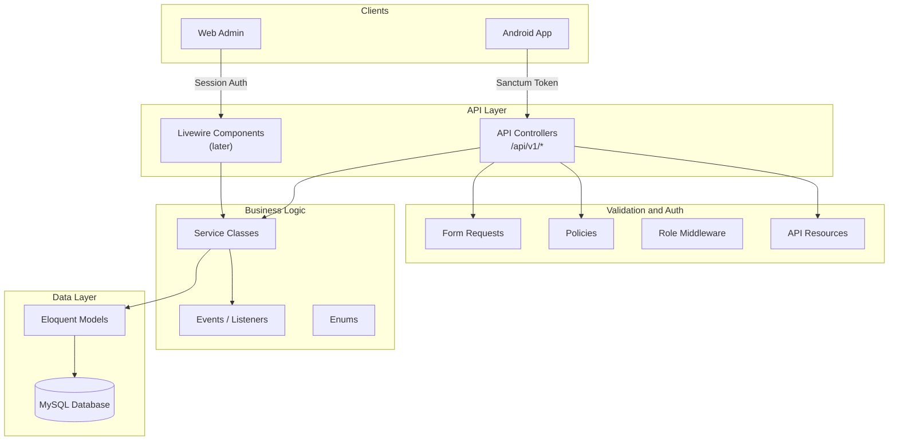
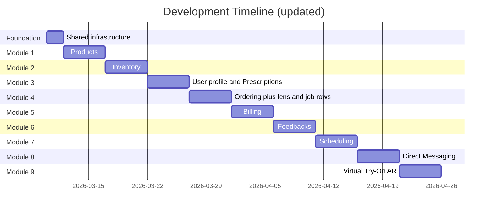

# Backend Foundation for Optical Management System (Updated: Prescriptions)

This document is a **copy of the backend foundation plan** with **prescription management** and related data model updates. Other capabilities (lens configuration, lab/fulfillment tracking) are **part of the ordering and customer-record domains**, not separate product modules.

> **Implementation update (2026-04-09):** Same as the base plan: **`ar_model_url` lives on `product_variants`**, not `products`. See migration `2026_04_09_160000_move_ar_model_url_to_product_variants` and `ProductService::applyArModelToDefaultVariant` for legacy product-level API fields. **`ProductVariantResource`** exposes `ar_model_url` per variant.

## Architecture Overview

Unchanged: **layered service architecture** — business logic in services; API controllers and Livewire remain thin.



## Directory Structure

Additions highlighted — everything else follows the same Laravel layout under `backend/app/`:

```
app/
├── Enums/
│   ├── UserRole.php                # admin, staff, customer (unchanged — no fourth role required)
│   ├── OrderStatus.php
│   ├── PaymentStatus.php
│   ├── AppointmentStatus.php
│   └── JobOrderStatus.php          # optional: submitted, processing, ready, delivered, completed, rejected
├── Http/
│   ├── Controllers/
│   │   └── Api/
│   │       └── V1/
│   │           ├── Auth/AuthController.php
│   │           ├── ProductController.php
│   │           ├── OrderController.php
│   │           ├── BillingController.php
│   │           ├── PrescriptionController.php    # NEW
│   │           ├── ServiceTypeController.php
│   │           ├── ScheduleTemplateController.php
│   │           ├── TimeSlotController.php
│   │           ├── AppointmentController.php
│   │           ├── ConversationController.php
│   │           ├── MessageController.php
│   │           ├── InventoryController.php
│   │           └── FeedbackController.php
│   ├── Middleware/
│   │   └── EnsureUserHasRole.php
│   ├── Requests/Api/V1/
│   └── Resources/V1/
├── Models/
│   ├── Prescription.php              # NEW
│   └── ... (existing)
├── Policies/
│   └── PrescriptionPolicy.php        # NEW — admin/staff write; customer read own; no self-service Rx entry
├── Services/
│   ├── PrescriptionService.php       # NEW
│   └── ...
└── ...
```

## Database Schema (Core Entities)

Updated ER diagram: **User** extended; **Prescription** added; **OrderItem** links optional prescription and optional **JobOrder** / lens line details.

```mermaid
erDiagram
    User ||--o{ Order : places
    User ||--o{ Appointment : books
    User ||--o{ Feedback : writes
    User ||--o{ Conversation : starts
    User ||--o{ Prescription : "patient"
    User {
        bigint id PK
        string name
        string email UK
        string password
        string phone
        enum role
        string avatar_url
        date date_of_birth_nullable
        string address_nullable
        text customer_notes_nullable
        timestamp email_verified_at
    }

    Appointment ||--o| Prescription : may_produce
    User ||--o{ Prescription : "prescriber"
    Prescription {
        bigint id PK
        bigint patient_user_id FK
        bigint appointment_id FK_nullable
        decimal od_sphere
        decimal od_cylinder
        int od_axis_nullable
        decimal od_add_nullable
        decimal os_sphere
        decimal os_cylinder
        int os_axis_nullable
        decimal os_add_nullable
        decimal pd_nullable
        decimal pd_right_nullable
        decimal pd_left_nullable
        text clinical_notes_nullable
        bigint prescribed_by_user_id FK
        date prescribed_on
        date expires_on_nullable
        timestamps
    }

    Supplier ||--o{ Product : supplies
    ProductCategory ||--o{ Product : contains
    Product ||--o{ ProductImage : has
    Product ||--o{ ProductVariant : has
    Product ||--o{ Feedback : reviewed_in
    ProductVariant ||--o{ OrderItem : ordered_as
    ProductVariant ||--o| Inventory : tracked_in
    Product {
        bigint id PK
        bigint category_id FK
        bigint supplier_id FK_nullable
        string name
        text description
        decimal price
        decimal cost_per_unit
        string brand
        boolean is_active
    }

    ProductVariant {
        bigint id PK
        bigint product_id FK
        string sku UK
        string color
        string frame_size
        string material
        string lens_type
        string base_curve
        string diameter
        decimal price_adjustment
        boolean is_default
        string ar_model_url_nullable
    }

    ProductCategory {
        bigint id PK
        string name
        string slug UK
        text description
        boolean has_ar_support
        boolean requires_expiry_tracking
    }

    Supplier {
        bigint id PK
        string name
        string contact_person
        string phone
        string email
        text address
        boolean is_active
    }

    ProductImage {
        bigint id PK
        bigint product_id FK
        string image_url
        integer sort_order
    }

    Order ||--o{ OrderItem : contains
    Order {
        bigint id PK
        bigint user_id FK_nullable
        string walk_in_name
        string walk_in_phone
        string order_number UK
        enum status
        decimal total_amount
        decimal discount_amount
        text notes
    }

    OrderItem ||--o| OrderItemLensDetail : may_have
    OrderItem ||--o| JobOrder : may_have
    Prescription ||--o{ OrderItemLensDetail : referenced_by
    OrderItem {
        bigint id PK
        bigint order_id FK
        bigint product_variant_id FK
        integer quantity
        decimal unit_price
        decimal subtotal
        text item_notes_nullable
    }

    OrderItemLensDetail {
        bigint id PK
        bigint order_item_id FK
        bigint prescription_id FK_nullable
        string lens_material_nullable
        string lens_design_nullable
        string lens_coatings_nullable
        text fulfillment_notes_nullable
    }

    JobOrder {
        bigint id PK
        bigint order_item_id FK
        string job_order_number UK
        string lab_name_nullable
        enum status
        date expected_completion_date_nullable
        timestamp completed_at_nullable
        text notes_nullable
    }

    Order ||--o| Bill : generates
    Appointment ||--o| Bill : generates

    Bill {
        bigint id PK
        bigint order_id FK_nullable
        bigint appointment_id FK_nullable
        string invoice_number UK
        decimal amount
        decimal amount_paid
        decimal balance_due
        enum payment_status
        string payment_method
        timestamp paid_at
    }

    ScheduleTemplate ||--o{ TimeSlot : generates
    ScheduleTemplate {
        bigint id PK
        integer day_of_week
        time start_time
        time end_time
        integer slot_duration_minutes
        integer max_capacity
        boolean is_active
    }

    ServiceType ||--o{ Appointment : categorizes
    ServiceType {
        bigint id PK
        string name
        text description
        integer default_duration_minutes
        decimal default_fee
        boolean is_active
    }

    TimeSlot ||--o{ Appointment : booked_in
    TimeSlot {
        bigint id PK
        date date
        time start_time
        time end_time
        integer max_capacity
        boolean is_available
    }

    Appointment {
        bigint id PK
        bigint user_id FK_nullable
        string walk_in_name
        string walk_in_phone
        bigint time_slot_id FK
        bigint service_type_id FK
        decimal fee
        enum status
        text notes
        text staff_notes
    }

    Conversation ||--o{ Message : contains
    Conversation {
        bigint id PK
        bigint customer_id FK
        string subject
        timestamp last_message_at
    }

    Message {
        bigint id PK
        bigint conversation_id FK
        bigint sender_id FK
        text body
        timestamp read_at
    }

    Inventory {
        bigint id PK
        bigint product_variant_id FK
        integer quantity
        integer reorder_level
        integer reorder_quantity
        string batch_number
        date expires_at
        text notes
    }

    Inventory ||--o{ InventoryAdjustment : tracks
    InventoryAdjustment {
        bigint id PK
        bigint inventory_id FK
        integer quantity_before
        integer quantity_after
        integer delta
        string adjustment_type
        string reason
        bigint adjusted_by FK_nullable
    }

    Feedback {
        bigint id PK
        bigint user_id FK
        bigint product_id FK
        integer rating
        text comment
    }
```

**Naming note:** Adjust column names to match Laravel style (`prescribed_at` vs `prescribed_on`) consistently in migrations; the diagram above is conceptual.

## Module Behavior Summary

**Products** — Same as the updated base plan: catalog, variants, default variant, **per-variant `ar_model_url`** for AR try-on (when the category has `has_ar_support`), categories, suppliers.

**Customer records (User)** — Extended for clinic use: optional `date_of_birth`, `address`, `customer_notes` on users with role `customer` (staff/admin may also have profile fields as needed). These fields support SC/PWD verification workflows and contact info; they are **not** a full EMR.

**Prescriptions** — **New domain.** After an in-person examination, **admin or staff** (per `PrescriptionPolicy` and clinic policy) creates or updates a `prescriptions` row for the patient `user_id`. Optional link to `appointment_id` when the Rx follows a booked service. Stores OD/OS sphere, cylinder, axis, add, PD (and optional split PD), short notes, `prescribed_by_user_id`, dates. **Customers** may **read** their own prescription history via API; they **cannot** self-prescribe. Sensitive fields may be encrypted at rest (application-level or DB) as required by the implementation phase. Access and changes should be auditable (see Key Decisions).

**Ordering** — In-store pickup; cart client-side. **Extended:** an `order_items` row may have an associated **order item lens detail** row when the line is a prescription-lens or custom-lens workflow: references optional `prescription_id`, lens material/design/coatings text or enum-backed fields, fulfillment notes. **Job orders** (lab tracking) are optional rows **per relevant order item** — status, lab name, expected completion — not a separate top-level “module” in the app structure, but a **sub-resource** of order fulfillment. Stock validation and cancellation rules unchanged.

**Billing** — Unchanged: bills for orders and paid appointments; partial payments; void/refund rules.

**Scheduling** — Unchanged: templates, slots, appointments, fees, bills. Optional: creating a prescription **after** an appointment links `appointment_id` on `prescriptions`.

**Direct Messaging** — Unchanged from original (Reverb + REST) unless the team scopes down to REST-only polling; implementation detail.

**Inventory** — Unchanged: per variant, adjustments, expiry by category.

**Feedbacks** — Unchanged.

**Virtual Try-On** — **`ar_model_url` on `product_variants`** (optional per sellable variant); category `has_ar_support` gates AR-capable categories. Legacy product-level API fields map to the default variant.

## Key Decisions

- **Roles:** Still **three** roles (`admin`, `staff`, `customer`). **No required fourth role** (e.g. optometrist). Use `prescribed_by_user_id` on `prescriptions` for accountability; optionally add `is_prescriber` or license field later if policies must restrict which staff may save Rx.
- **Staff permissions (extended):** Staff may create/update **prescriptions** and link them to orders **if** policy allows; customers read-only own prescriptions.
- **Data privacy (RA 10173):** Prescription data is **sensitive personal information**. Mitigations: least-privilege access, encryption at rest for designated columns if implemented, audit logging of read/write, consent captured in registration or clinic process (document in capstone). **Not** “exclude prescriptions” — **include** with safeguards.
- **Ordering paragraph superseded:** The backend **does** store prescription-linked **order line** details where applicable; customers do not enter Rx online without staff validation.
- All other Key Decisions from the original plan still apply: API versioning, Sanctum, soft deletes where listed, SKU on variants, walk-ins, client-side cart, schedule templates, appointment billing, etc.

## Development Approach: Foundation + Module-by-Module

Same layered pattern per feature: migration → model → enum → service → controller → form requests → resources → policy → routes → seeder.

Suggested **gantt** (adjust dates to your timeline):



### Phase 0: Shared Foundation (1–2 days)

1. Database config (MySQL), `.env.example`
2. **Users:** `role`, `phone`, `avatar_url`, and **optional** `date_of_birth`, `address`, `customer_notes` (nullable)
3. `UserRole` enum
4. Sanctum auth + profile endpoint returning allowed fields per role
5. `EnsureUserHasRole` middleware
6. `/api/v1/` routes, JSON exception format
7. User seeders

### Phase: Products, Inventory

Same as original plan (product_categories, suppliers, products, images, variants, inventory, adjustments), including **per-variant `ar_model_url`** for virtual try-on (see implementation note at top).

### Phase: Prescriptions (new)

- **Migrations:** `prescriptions` table; foreign keys: `patient_user_id` → users, `appointment_id` nullable → appointments (when scheduling exists; migration order may require prescriptions after appointments or nullable FK without constraint until appointments ship), `prescribed_by_user_id` → users
- **Model:** `Prescription` with relations to User (patient, prescriber), Appointment optional
- **Service:** `PrescriptionService` — list (scoped), create, update, show; customers scoped to `auth()->id()`
- **Controller:** `PrescriptionController`
- **Policy:** `PrescriptionPolicy`
- **Form requests:** `StorePrescriptionRequest`, `UpdatePrescriptionRequest`
- **API resources:** `PrescriptionResource`

**Example endpoints (indicative):**

- `GET    /api/v1/prescriptions` — admin/staff: list with filters; customer: own only
- `GET    /api/v1/prescriptions/{id}` — admin/staff or owning customer
- `POST   /api/v1/prescriptions` — admin/staff
- `PUT    /api/v1/prescriptions/{id}` — admin/staff
- `DELETE /api/v1/prescriptions/{id}` — admin only (or soft delete if preferred)

### Phase: Ordering (extended)

- **Migrations:** `order_item_lens_details` (or merge into `order_items` if few columns), `job_orders` linked to `order_items`
- **Models:** `OrderItemLensDetail`, `JobOrder`; extend `OrderService` to validate `prescription_id` belongs to order’s customer when provided
- **Endpoints:** extend order create/update payloads to accept nested lens details and job metadata per line item

### Phase: Billing, Feedbacks, Scheduling, Messaging, AR

Same as original plan; scheduling module adds optional workflow to attach new prescription to `appointment_id`.

## Scope and Limitations (for Capstone Paper)

**In scope:**

- Everything from the original “in scope” list (catalog, pickup orders, billing, scheduling, messaging, inventory, feedback, AR with **per-variant** 3D model URLs, walk-ins, RBAC, SMS structure)
- **Prescription management:** record, update, list, and view (role-scoped); link to appointments and order lines where applicable
- **Order lines:** optional lens and fulfillment details and optional job/lab tracking **as part of order processing**
- **Customer profile fields:** DOB, address, notes for operational use

**Limitations:**

- **Not** an electronic medical record; **not** telemedicine or online refraction
- Customers **cannot** self-prescribe or bypass in-person professional evaluation for new prescriptions (policy + UI)
- AR does **not** perform vision assessment, automated Rx, or PD measurement unless explicitly added later
- Automated SC/PWD discount rules still out of scope; manual `discount_amount` on orders remains
- No payment gateway, no delivery, no multi-branch (unchanged)
- Full legal/compliance program (DPO, DPIA, breach process) beyond reasonable student-project controls may be cited as **future work**

**Future recommendations:**

- Automated SC/PWD discount calculation
- Bundles, promos, payment gateways (GCash, Maya)
- Multi-branch
- Stronger encryption/HSM, formal audit productization, consent management UI

## Module Development Pattern

Unchanged: migration → model → enum → service → controller → form requests → resources → policy → routes → seeder.

---

## Relation to Original Plan File

This file supersedes **[backend_foundation_setup_5b4f9e9c.plan.md](backend_foundation_setup_5b4f9e9c.plan.md)** for scope: **prescriptions and related order/customer data are in**; the old “prescriptions excluded for RA 10173” limitation is **replaced** by “prescriptions included with privacy safeguards.”
